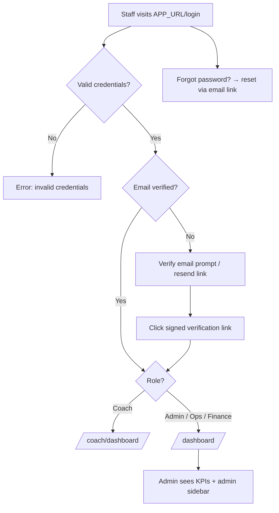

# UAT Section A — Authentication & Access Control (All Staff)

> Part of the [X Chess Academy OS UAT Plan](../UAT.md) · Status legend: ✅ Pass · ❌ Fail · ⚠️ Blocked · ⬜ Not Run

## 1. Authentication Flow

**Pre-conditions:** demo accounts seeded; `Password123!` for all staff.

| ID | Test Case | Steps | Expected Result | Status | Notes |
| :--- | :--- | :--- | :--- | :---: | :--- |
| AUTH-01 | Admin login | Go to `/login` → enter `demo-admin@example.com` / `Password123!` → submit | Redirected to `/dashboard`; KPI cards (students, classes, pending invoices, monthly revenue) and admin sidebar visible | ⬜ | |
| AUTH-02 | Coach login redirect | Login as `coach1@example.com` | Auto-redirected to `/coach/dashboard` (today's sessions) | ⬜ | |
| AUTH-03 | Ops login | Login as `ops1@example.com` | Login succeeds; lands on `/dashboard` with a working page appropriate to the Ops role (log actual behavior) | ⬜ | Known gap: role dashboard pending ([TASKS.md](../../TASKS.md) Phase 4) |
| AUTH-04 | Finance login | Login as `finance1@example.com` | Login succeeds; lands on `/dashboard` with a working page appropriate to the Finance role (log actual behavior) | ⬜ | Known gap: role dashboard pending ([TASKS.md](../../TASKS.md) Phase 4) |
| AUTH-05 | Invalid credentials | Login with `demo-admin@example.com` / `wrong-password` | Error message shown; no session created; stays on `/login` | ⬜ | |
| AUTH-06 | Unverified email blocked | Create a user without verifying email → login → visit `/dashboard` | Redirected to email verification prompt; dashboard not accessible | ⬜ | |
| AUTH-07 | Email verification flow | From AUTH-06, click "resend" → open signed link from email | Email verified; `/dashboard` now accessible | ⬜ | |
| AUTH-08 | Forgot password flow | `/forgot-password` → enter staff email → open reset link → set new password → login | Password reset works; new password accepted | ⬜ | |
| AUTH-09 | Logout | Login as any staff → click Logout | Session ends; visiting `/dashboard` redirects to `/login` | ⬜ | |
| AUTH-10 | Self-service profile | Login as any staff → `/profile` → update name/email → save; change password; (optionally) delete account | Profile updates persist; password change requires current password; deletion removes account | ⬜ | |
| AUTH-11 | Public registration role | Register a new account via `/register` | Account is created with the **Ops** role and requires email verification | ⬜ | Default role per `RegisteredUserController` |

## 2. Access Control — Negative Tests (403 / Redirects)

**Method:** login as the role listed under "Actor", then open the URL directly in the browser.

| ID | Actor | URL / Action | Expected Result | Status | Notes |
| :--- | :--- | :--- | :--- | :---: | :--- |
| AUTH-20 | Guest (not logged in) | `/dashboard`, `/admin/users`, `/coach/dashboard` | Redirected to `/login` | ⬜ | |
| AUTH-21 | Coach | `/admin/users` | 403 Forbidden (no user management for coaches) | ⬜ | |
| AUTH-22 | Coach | `/admin/invoices` | 403 Forbidden | ⬜ | |
| AUTH-23 | Coach | `/admin/settings` | 403 Forbidden | ⬜ | |
| AUTH-24 | Ops | `/admin/users` | 403 Forbidden (matrix: user management is Admin-only) | ⬜ | |
| AUTH-25 | Ops | `/admin/settings` | 403 Forbidden (matrix: settings are Admin-only) | ⬜ | |
| AUTH-26 | Ops | `/admin/invoices` | Per matrix Ops should have 👁️ Read — log actual result as defect if 403 | ⬜ | Known gap — see [permissions matrix note](../UAT.md#42-staff-role-permissions-matrix-acceptance-baseline) |
| AUTH-27 | Finance | `/admin/users` | 403 Forbidden (user management is Admin-only) | ⬜ | |
| AUTH-28 | Finance | `/admin/settings` | 403 Forbidden (settings are Admin-only) | ⬜ | |
| AUTH-29 | Finance | `/admin/students/{id}` (financial context) | 200 — student financial profile (classes, invoices, adjustments) visible | ⬜ | Explicitly allowed for Admin+Finance |
| AUTH-30 | Ops | `/admin/students/{id}` (financial context) | 403 Forbidden — Ops must not see financial detail | ⬜ | |
| AUTH-31 | Coach | `/admin/students/{id}` | 403 Forbidden — coaches use `/coach/students` only | ⬜ | |
| AUTH-32 | Coach A | `/coach/students/{id}` where the student is NOT in Coach A's classes | 403 Forbidden (data isolation) | ⬜ | |
| AUTH-33 | Admin | Any `/admin/*` or `/coach/*` URL | 200 — Admin bypasses all role guards | ⬜ | |
| AUTH-34 | Admin | Users page → attempt to delete own account | Deletion blocked (cannot delete self) | ⬜ | |
| AUTH-35 | Parent (token holder) | `/admin/invoices` while only holding a portal token | Redirect to `/login` — portal tokens never grant staff access | ⬜ | |

## 3. In-App Notification Center (all roles)

| ID | Test Case | Steps | Expected Result | Status | Notes |
| :--- | :--- | :--- | :--- | :---: | :--- |
| AUTH-40 | Notification bell | Login as any staff → observe bell icon in top bar | Bell visible; unread count badge appears when there are unread notifications; dropdown polls every ~45s | ⬜ | |
| AUTH-41 | Inbox page | Click bell → open inbox (`/me/notifications`) | Inbox lists own notifications; filters (All/Unread, type) work | ⬜ | |
| AUTH-42 | Mark read / read all | Mark one notification read; then "mark all read" | Notification marked read; unread badge count updates; read-all clears the badge | ⬜ | |
| AUTH-43 | Isolation of notifications | Compare inbox of two different users | Each user sees only their own notifications | ⬜ | |

---

## Section Result Summary

| Total Cases | Pass | Fail | Blocked | Not Run | Pass Rate |
| :---: | :---: | :---: | :---: | :---: | :---: |
| 31 | | | | | |
