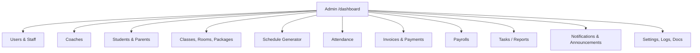

# UAT Section B — Admin

> Part of the [X Chess Academy OS UAT Plan](../UAT.md) · Status legend: ✅ Pass · ❌ Fail · ⚠️ Blocked · ⬜ Not Run

## 1. Admin Portal Flow

**Pre-conditions:** logged in as `demo-admin@example.com`.

## 2. Dashboard

| ID | Test Case | Steps | Expected Result | Status | Notes |
| :--- | :--- | :--- | :--- | :---: | :--- |
| ADM-01 | KPI cards | Open `/dashboard` | Total Students, Total Classes, Pending Invoices, Monthly Revenue cards render with plausible values from seeded data | ⬜ | |
| ADM-02 | Unread notifications widget | Open `/dashboard` | Recent unread notifications list appears (max ~8) | ⬜ | |

## 3. Users & Staff Management

| ID | Test Case | Steps | Expected Result | Status | Notes |
| :--- | :--- | :--- | :--- | :---: | :--- |
| ADM-10 | User list | Open **Users** (`/admin/users`) | All staff listed with name, email, role; search/filter works | ⬜ | |
| ADM-11 | Create user | "Add New User" → name, email, password, role `Finance` → save | User appears in list with role Finance; can log in | ⬜ | |
| ADM-12 | Dual-role coach flag | Create/edit user → check **"Also acts as a Coach"** → save | Flag persists; user appears in coach selectors (Classes, Payroll) | ⬜ | |
| ADM-13 | Change role | Change a user's role (e.g. Ops → Finance) | Role updates immediately and is reflected in list + access | ⬜ | |
| ADM-14 | Update user | Edit name/email of a user → save | Changes persist | ⬜ | |
| ADM-15 | Delete user | Delete a non-self user | User removed; cannot log in | ⬜ | |
| ADM-16 | Cannot delete self | Attempt to delete the logged-in admin | Blocked with error | ⬜ | |
| ADM-17 | Validation | Create user with invalid email / short password / missing name | Validation errors shown inline; user not created | ⬜ | |
| ADM-18 | Duplicate email | Create user with an existing email | Rejected with validation error | ⬜ | |
| ADM-19 | Activity log written | After ADM-11–ADM-15, open **Activity Logs** | User create/update/delete actions logged with old/new values | ⬜ | |

## 4. Coaches

| ID | Test Case | Steps | Expected Result | Status | Notes |
| :--- | :--- | :--- | :--- | :---: | :--- |
| ADM-20 | Coach list | Open **Coaches** (`/admin/coaches`) | Coach profiles listed (demo: 6 coaches with levels Beginner → Master) | ⬜ | |
| ADM-21 | Create coach profile | Add coach → phone, NRIC, level, hourly rate, bank details, availability → save | Coach created and appears in lists/selectors | ⬜ | |
| ADM-22 | Edit coach | Change hourly rate & level → save | Values persist | ⬜ | |
| ADM-23 | Delete coach | Delete a coach not assigned to classes | Coach removed | ⬜ | |
| ADM-24 | Coach availability | Edit availability days/slots → save | Availability persists and shows on coach detail | ⬜ | |

## 5. Packages, Rooms & Classes

| ID | Test Case | Steps | Expected Result | Status | Notes |
| :--- | :--- | :--- | :--- | :---: | :--- |
| ADM-30 | Package CRUD | Create package (title, monthly fee, sessions per month) → edit → list | Package CRUD works; `sessions_per_month` shown | ⬜ | |
| ADM-31 | Room CRUD | Create room (name, capacity/description) → edit → list | Room CRUD works | ⬜ | |
| ADM-32 | Room schedule view | Open room schedule (`/admin/rooms/{id}/schedule`) | Room's occupied dates/sessions shown | ⬜ | |
| ADM-33 | Create class | Create class → name, package, coach, room, day of week, start/end time, capacity → save | Class created with UID; appears in Classes list | ⬜ | |
| ADM-34 | Edit class | Change coach/room/time → save | Changes persist | ⬜ | |
| ADM-35 | Enroll student | Open class → enroll an active student | Student appears in class roster | ⬜ | |
| ADM-36 | Unenroll student | Remove a student from the class | Student removed from roster | ⬜ | |
| ADM-37 | Class capacity validation | Enroll more students than capacity | Warning/block per spec — log actual behavior | ⬜ | |
| ADM-38 | Manual class schedule edit | Update class schedules (`PUT /classes/{id}/schedules`) | Schedule dates update; invalid dates rejected | ⬜ | |

## 6. Schedule Generator

**Pre-conditions:** at least one class with day-of-week + package configured.

| ID | Test Case | Steps | Expected Result | Status | Notes |
| :--- | :--- | :--- | :--- | :---: | :--- |
| ADM-40 | Generator page | Open **Schedules** (`/admin/schedules`) | Redirects to the Schedule Generator UI with month picker and package filter | ⬜ | |
| ADM-41 | Preview month | Select month → Preview | Calendar shows "busy days" with class counts/names for the month | ⬜ | |
| ADM-42 | Generate schedule | Select month → Generate | Success message "Schedules generated for N classes"; class schedule arrays now contain that month's dates matching each class day-of-week | ⬜ | |
| ADM-43 | Exclude dates | Mark academy-closed dates as excluded → Generate | Excluded dates absent from generated schedules | ⬜ | |
| ADM-44 | Package session limit | Generate for a package with `sessions_per_month = 4` | Class gets at most 4 sessions that month | ⬜ | |
| ADM-45 | Regeneration is per-month safe | Generate month M, then generate month M+1 | Month M dates untouched; other months never removed | ⬜ | |
| ADM-46 | Re-run same month | Generate month M twice | Same month dates replaced cleanly (no duplicates) | ⬜ | |
| ADM-47 | Preview clear | Preview-clear for a month containing sessions with attendance | Shows total vs **protected** (has attendance/delivered session) vs deletable counts | ⬜ | |
| ADM-48 | Clear protects delivered sessions | Execute clear for that month | Sessions with attendance/ClassSession records are **kept**; only unstarted dates removed; success message states cleared count | ⬜ | |
| ADM-49 | Package filter scope | Filter generation to one package only | Only that package's classes affected | ⬜ | |

## 7. Students & Parents

| ID | Test Case | Steps | Expected Result | Status | Notes |
| :--- | :--- | :--- | :--- | :---: | :--- |
| ADM-50 | Student list | Open **Students** | Students listed with UID (`STU-XXXXXX`), name, parent, status; search works | ⬜ | |
| ADM-51 | Create student (new parent) | Add student → fill name, NRIC/passport, DOB (before today), language, registration date, parent mode **New** (parent name/email/phone), recurring discount | Student created with generated unique UID; parent auto-created with portal token; both appear in lists | ⬜ | |
| ADM-52 | Create student (existing parent) | Parent mode **Existing** → search/select parent | Student linked to existing parent; no duplicate parent created | ⬜ | |
| ADM-53 | Duplicate parent email (bulk) | Bulk-create two students with the same new-parent email | Second row reuses the first parent (no duplicate parents) | ⬜ | |
| ADM-54 | Bulk create students | Students → Bulk Create → add 3+ rows (mix existing/new parent) → submit | All students created in one transaction; success message | ⬜ | |
| ADM-55 | Bulk actions | Select multiple students → bulk update status → `Inactive` | All selected students' status changes | ⬜ | Also test `update_level`, `update_language`, delete |
| ADM-56 | Edit student | Change name/level/discount → save | Changes persist | ⬜ | |
| ADM-57 | Student show (financial context) | Open a student profile (`/admin/students/{id}`) | Profile shows parent, classes, invoice history, adjustments, attendance history | ⬜ | Admin+Finance route group |
| ADM-58 | Parent search | Students create form → parent search by name/email/phone | Matching parents suggested | ⬜ | |
| ADM-59 | Parents CRUD | Open **Parents** → create/edit/list | Parent CRUD works; each parent has a unique access token; token URL opens the portal | ⬜ | |
| ADM-60 | Update parent from student | Update parent details via student context | Parent record updated | ⬜ | |
| ADM-61 | Student validation | Create student with DOB in the future / invalid NRIC length | Validation errors shown; not created | ⬜ | |

## 8. Attendance (Admin side)

| ID | Test Case | Steps | Expected Result | Status | Notes |
| :--- | :--- | :--- | :--- | :---: | :--- |
| ADM-70 | Attendance index | Open **Attendance** | Attendance overview loads (classes/dates with recorded attendance) | ⬜ | |
| ADM-71 | Record attendance | Open class/date → mark students present/absent → save | Attendance records saved; roster reflects statuses | ⬜ | |
| ADM-72 | Update attendance | Change a student's status → save | Record updated (no duplicates) | ⬜ | |
| ADM-73 | Delete attendance | Delete a class/date attendance set | Records removed | ⬜ | |
| ADM-74 | Attendance history on student | Open student profile → attendance history | Session history listed (date, class, room, time, present/absent) | ⬜ | |

## 9. Invoices, Adjustments & Payments

**Invoice status legend:** ⚪ Draft → 🟡 Pending → 🟢 Paid (🔴 Overdue when past due & unpaid).

| ID | Test Case | Steps | Expected Result | Status | Notes |
| :--- | :--- | :--- | :--- | :---: | :--- |
| ADM-80 | Invoice index & stats | Open **Invoices** | List loads with stat cards (Draft / Pending / Paid counts, total billed, total collected); month & status filters work | ⬜ | |
| ADM-81 | Monthly auto-generation | Run `php artisan invoices:generate-monthly` (or wait for the 1st) | Draft invoices created for every student with billable classes: `Base = Σ package monthly fees`, minus recurring discount, plus pending carry-forward adjustments; due date = +7 days; total never negative | ⬜ | Idempotent — re-run skips existing month/student |
| ADM-82 | Skip no-bill students | Ensure a student has no class/package → run generator | No invoice for that student | ⬜ | |
| ADM-83 | Add credit adjustment | Open a **Draft** invoice → add Credit (amount + reason) → save | Line item listed; total decreases by amount | ⬜ | |
| ADM-84 | Add charge adjustment | Add a Charge line item | Line item listed; total increases | ⬜ | |
| ADM-85 | Total clamped at zero | Add credit larger than the total | Total = 0 (never negative) | ⬜ | |
| ADM-86 | Adjustments locked after send | On a Pending/Paid invoice, attempt to edit adjustments | Blocked with error "Adjustments can only be edited while the invoice is in Draft status" | ⬜ | |
| ADM-87 | Send invoice | On a reviewed Draft, click **Send Invoice** | Status → Pending; parent notified (email + portal link); activity logged; invoice visible in parent portal | ⬜ | |
| ADM-88 | Send non-draft blocked | Attempt to send a Pending invoice | Blocked with error | ⬜ | |
| ADM-89 | PDF invoice download | Download PDF invoice | Branded PDF streams/downloads with academy name, SSM no, contact, bank details from Settings; itemized breakdown matches invoice | ⬜ | |
| ADM-90 | Carry-forward adjustment | Use "Record Adjustment for Next Month" (credit or charge) on an invoice/student | Stored as **pending**; auto-applied to the student's next generated Draft invoice as an itemized line; never reused after applying | ⬜ | |
| ADM-91 | Student-level adjustments CRUD | Student profile → adjustments → create/update/delete | Adjustment records managed correctly; only Admin/Finance can access | ⬜ | Route group `role:Admin,Finance` |
| ADM-92 | Payments list | Open **Payments** | Recorded payments listed with method, date, transaction ID | ⬜ | |
| ADM-93 | Mark overdue | Advance date (or run `notifications:run`) on a past-due Pending invoice | Status becomes Overdue; overdue notification dispatched | ⬜ | |

## 10. Payrolls

**Payroll status legend:** ⚪ Draft → 🟡 Processed (approved) → 🟢 Paid.

| ID | Test Case | Steps | Expected Result | Status | Notes |
| :--- | :--- | :--- | :--- | :---: | :--- |
| ADM-100 | Payroll list & stats | Open **Payrolls** | List loads with Draft/Processed/Paid counts and paid amount; month & status filters work | ⬜ | |
| ADM-101 | Monthly payroll generation | Run `php artisan payroll:generate-monthly` (or wait for the 1st, 00:30) | Per-coach payrolls created: delivered sessions summed by package coach rate; line-item snapshots saved; Draft status | ⬜ | Re-running preserves an existing status |
| ADM-102 | Payroll detail | Click View on a payroll | Modal shows summary, session/date/package/rate breakdown, and activity trail | ⬜ | |
| ADM-103 | Edit Draft payroll | Open a Draft payroll → Edit → change sessions/rate/total → Save | Values update; list/stats refresh; activity trail records before/after and Admin | ⬜ | |
| ADM-104 | Lock processed/paid edits | Attempt to edit a Processed or Paid payroll | Edit action unavailable; API rejects update | ⬜ | |
| ADM-105 | Approve payroll | Approve a Draft payroll | Status → Processed; activity trail records actor/time | ⬜ | |
| ADM-106 | Mark payroll paid | Mark a Processed payroll as paid | Status → Paid; paid stats update; activity trail records actor/time | ⬜ | |
| ADM-107 | Payroll matches attendance | Compare one coach's payroll line items vs delivered session pairs | Counts and rates match exactly | ⬜ | |
| ADM-108 | Coach details payroll history | Open a Coach Details page | Payroll History card lists that coach's payrolls and opens the same detail modal | ⬜ | |

## 11. Tasks, Reports, Notifications, Announcements

| ID | Test Case | Steps | Expected Result | Status | Notes |
| :--- | :--- | :--- | :--- | :---: | :--- |
| ADM-110 | Task CRUD | Create task (title, description, due date) → assign to a staff member/role → edit → complete → delete | Task lifecycle works | ⬜ | |
| ADM-111 | Task assignment notification | Assign a task to another staff user | Assignee receives an in-app notification (bell + inbox) | ⬜ | |
| ADM-112 | Reports page | Open **Reports** | Report index renders with available report views | ⬜ | |
| ADM-113 | Notification templates | Notifications → create/edit a notification template | Template CRUD works | ⬜ | |
| ADM-114 | Dispatches view | Open **Notifications → Dispatches** | History of dispatched notifications with status per channel (email/WhatsApp/in-app) | ⬜ | |
| ADM-115 | Announcement create & send | Create announcement → preview/show → **Send** | Announcement sent to the selected audience (email/portal); delivery recorded | ⬜ | |
| ADM-116 | Site announcement banner | Site Announcements → create a banner | Banner appears for intended audiences and can be edited/removed | ⬜ | |

## 12. Settings, Logs & Docs

| ID | Test Case | Steps | Expected Result | Status | Notes |
| :--- | :--- | :--- | :--- | :---: | :--- |
| ADM-120 | Company profile | Settings → Company Profile → update name, SSM reg no, email, phone, address, bank details → save | Values persist; PDF invoice/receipt immediately reflect new branding | ⬜ | |
| ADM-121 | Logo upload/remove | Settings → upload logo → save; then remove | Logo appears (invoices/header); removal reverts cleanly | ⬜ | |
| ADM-122 | SMTP settings + test | Settings → Email/SMTP → enter credentials → **Send Test Email** | Test email delivered to the target inbox | ⬜ | |
| ADM-123 | Chip settings + test | Settings → Chip Payment → brand ID, API key, environment (sandbox) → **Test Chip Connection** | Connection test succeeds (or clear error) | ⬜ | |
| ADM-124 | WhatsApp settings + test | Settings → WhatsApp → provider (Twilio/WABA/UltraMsg) + credentials → **Test WhatsApp** | Test message delivered (or clear error) | ⬜ | |
| ADM-125 | Notification settings | Settings → Notification System → enable/disable, daily dispatch limit, retry policy, admin alert email → save | Settings persist; behavior respected by `notifications:run` | ⬜ | |
| ADM-126 | Activity logs | Open **Activity Logs** | Chronological audit trail (user, action, subject, old→new values); filters work | ⬜ | spatie/activitylog |
| ADM-127 | System logs | Open **System Logs** | Laravel log entries viewable; **Clear** empties them | ⬜ | |
| ADM-128 | Docs viewer | Open **Docs** (`/admin/docs`) | In-app documentation browser renders the markdown docs | ⬜ | |

---

## Section Result Summary

| Total Cases | Pass | Fail | Blocked | Not Run | Pass Rate |
| :---: | :---: | :---: | :---: | :---: | :---: |
| 88 | | | | | |
