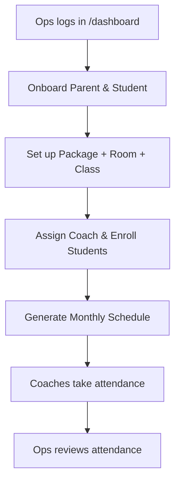

# UAT Section C — Ops (Operations Staff)

> Part of the [X Chess Academy OS UAT Plan](../UAT.md) · Status legend: ✅ Pass · ❌ Fail · ⚠️ Blocked · ⬜ Not Run

## 1. Ops Flow

> [!WARNING]
> **Known state:** most `/admin/*` pages currently sit behind `role:Admin` and the Ops dashboard is pending (see the [permissions matrix note](../UAT.md#42-staff-role-permissions-matrix-acceptance-baseline)). Execute these tests and **log every mismatch with the matrix as a defect** — that gap closure is part of acceptance. Where a test cannot run at all for Ops, mark **⚠️ Blocked** with a reference to the defect.

**Pre-conditions:** logged in as `ops1@example.com`.

| ID | Test Case | Steps | Expected Result | Status | Notes |
| :--- | :--- | :--- | :--- | :---: | :--- |
| OPS-01 | Dashboard access | Visit `/dashboard` | Working Ops dashboard (matrix baseline); log actual behavior | ⬜ | |
| OPS-02 | Student onboarding (single) | Perform ADM-51/ADM-52 steps as Ops | Ops can fully onboard students & parents | ⬜ | |
| OPS-03 | Student onboarding (bulk) | Perform ADM-54/ADM-55 steps as Ops | Bulk onboarding & bulk actions available to Ops | ⬜ | |
| OPS-04 | Parent management | Perform ADM-59 steps as Ops | Ops can manage parent records | ⬜ | |
| OPS-05 | Class setup | Perform ADM-33–ADM-36 steps as Ops | Ops can create classes and manage enrollment | ⬜ | |
| OPS-06 | Schedule generation | Perform ADM-41–ADM-49 steps as Ops | Ops can preview/generate/clear schedules | ⬜ | |
| OPS-07 | Attendance recording | Perform ADM-71 steps as Ops | Ops can record/update attendance | ⬜ | |
| OPS-08 | Read-only invoicing | Open **Invoices** as Ops | 👁️ Read-only view of invoices (no edit/send/adjust) | ⬜ | |
| OPS-09 | Read-only payroll | Open **Payrolls** as Ops | 👁️ Read-only view (no approve/mark paid) | ⬜ | |
| OPS-10 | No user management | Visit `/admin/users` as Ops | Access denied | ⬜ | = AUTH-24 |
| OPS-11 | No settings access | Visit `/admin/settings` as Ops | Access denied | ⬜ | = AUTH-25 |
| OPS-12 | No financial detail | Visit `/admin/students/{id}` as Ops | 403 — financial context hidden from Ops | ⬜ | = AUTH-30 |
| OPS-13 | Task notifications | Have Admin assign a task to Ops | Ops receives in-app notification | ⬜ | |

---

## Section Result Summary

| Total Cases | Pass | Fail | Blocked | Not Run | Pass Rate |
| :---: | :---: | :---: | :---: | :---: | :---: |
| 13 | | | | | |
