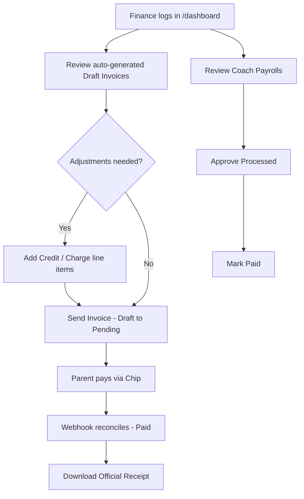

# UAT Section D — Finance

> Part of the [X Chess Academy OS UAT Plan](../UAT.md) · Status legend: ✅ Pass · ❌ Fail · ⚠️ Blocked · ⬜ Not Run

## 1. Finance Flow

**Pre-conditions:** logged in as `finance1@example.com`; monthly invoices generated (ADM-81).

| ID | Test Case | Steps | Expected Result | Status | Notes |
| :--- | :--- | :--- | :--- | :---: | :--- |
| FIN-01 | Dashboard access | Visit `/dashboard` | Working Finance dashboard (matrix baseline); log actual behavior | ⬜ | |
| FIN-02 | Student financial context | Open `/admin/students/{id}` | 200 — student profile with invoices, adjustments, classes | ⬜ | = AUTH-29 |
| FIN-03 | Invoice review (read) | Open **Invoices** | Finance can review Draft invoices and verify amounts vs packages/discounts | ⬜ | |
| FIN-04 | Add credit adjustment | Perform ADM-83 as Finance | Credit line item reduces the total | ⬜ | |
| FIN-05 | Add charge adjustment | Perform ADM-84 as Finance | Charge line item increases the total | ⬜ | |
| FIN-06 | Rounding & clamp | Add fractional amounts; over-credit | Totals rounded to 2 decimals; never below zero | ⬜ | = ADM-85 |
| FIN-07 | Send invoice | Perform ADM-87 as Finance | Status → Pending; parent notified via email with portal link | ⬜ | |
| FIN-08 | Carry-forward for next month | Perform ADM-90 as Finance | Pending adjustment created; auto-applied to the next Draft invoice, exactly once | ⬜ | |
| FIN-09 | Student adjustments CRUD | Perform ADM-91 as Finance | Finance can create/update/delete student adjustments | ⬜ | |
| FIN-10 | PDF invoice | Download a PDF invoice as Finance | Branded, accurate PDF | ⬜ | |
| FIN-11 | Payroll review | Open **Payrolls** as Finance | Finance can review payroll sessions × rate | ⬜ | |
| FIN-12 | Payroll approval | Perform ADM-102 as Finance | Status → Processed | ⬜ | |
| FIN-13 | Payroll mark paid | Perform ADM-103 as Finance | Status → Paid | ⬜ | |
| FIN-14 | No user management | Visit `/admin/users` as Finance | Access denied | ⬜ | = AUTH-27 |
| FIN-15 | No settings access | Visit `/admin/settings` as Finance | Access denied | ⬜ | = AUTH-28 |
| FIN-16 | No onboarding writes | Attempt student create/edit as Finance | Matrix: 👁️ Read — no create/edit/delete; log actual behavior | ⬜ | |
| FIN-17 | No class/schedule writes | Attempt to create a class or generate schedules as Finance | Matrix: 👁️ Read — no writes; log actual behavior | ⬜ | |
| FIN-18 | Payments visibility | Open **Payments** as Finance | Payment records visible for reconciliation | ⬜ | |
| FIN-19 | Manual payment record | Record a manual payment (e.g. bank transfer) against an invoice | Payment saved with method/date/transaction reference | ⬜ | |
| FIN-20 | Invoice sent notification | After FIN-07, check own inbox | Finance role receives "invoice sent / pending" notification where configured | ⬜ | |

---

## Section Result Summary

| Total Cases | Pass | Fail | Blocked | Not Run | Pass Rate |
| :---: | :---: | :---: | :---: | :---: | :---: |
| 20 | | | | | |
