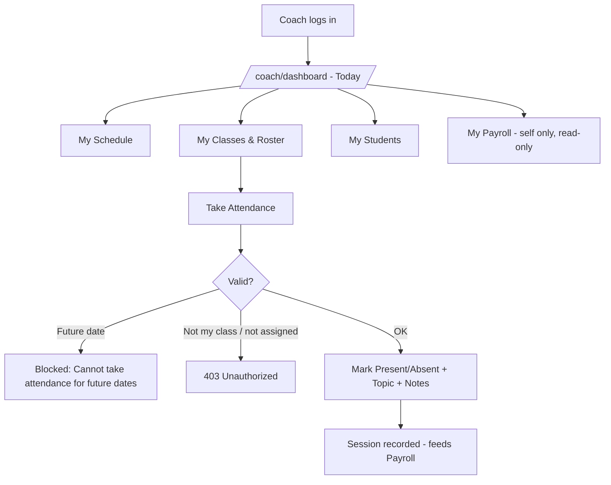

# UAT Section E — Coach

> Part of the [X Chess Academy OS UAT Plan](../UAT.md) · Status legend: ✅ Pass · ❌ Fail · ⚠️ Blocked · ⬜ Not Run

## 1. Coach Portal Flow (mobile-first)

**Pre-conditions:** logged in as `coach1@example.com` (has assigned classes); mobile viewport recommended.

| ID | Test Case | Steps | Expected Result | Status | Notes |
| :--- | :--- | :--- | :--- | :---: | :--- |
| CCH-01 | Dashboard — today's sessions | Open `/coach/dashboard` | Today's sessions (or a clear "no sessions" state) with class, time, room; mobile layout is clean | ⬜ | |
| CCH-02 | My schedule | Open **Schedule** | Only the coach's own class sessions listed chronologically | ⬜ | |
| CCH-03 | My classes | Open **Classes** | Only classes where this coach is the default coach (or assigned to a session) | ⬜ | |
| CCH-04 | Class detail | Open a class | Roster (active students), schedule dates, room/time details | ⬜ | |
| CCH-05 | My students | Open **Students** | Only students enrolled in the coach's classes | ⬜ | |
| CCH-06 | Student profile | Open a student from the list | Student details + attendance history for this coach's classes | ⬜ | |
| CCH-07 | Take attendance | Open a class session for today/past date → mark each student Present/Absent → add topic & notes → save | "Attendance saved successfully"; statuses persist; topic/notes stored on the session | ⬜ | |
| CCH-08 | Update attendance | Re-open the same class/date → change statuses → save | Records updated in place (no duplicates) | ⬜ | |
| CCH-09 | Future date blocked | Attempt to store attendance for a future date | Error: "Cannot take attendance for future dates." | ⬜ | |
| CCH-10 | Another coach's class blocked | Open `/coach/attendances/{classId}/{date}` for a class not assigned to this coach | 403 Unauthorized | ⬜ | |
| CCH-11 | Substitute coach allowed | Have Admin set a session's coach to Coach B → Coach B opens that class/date | Coach B authorized to record attendance for that session | ⬜ | Session-level `coach_id` |
| CCH-12 | Student isolation | Open `/coach/students/{id}` of a student not in the coach's classes | 403 Forbidden | ⬜ | = AUTH-32 |
| CCH-13 | My payroll | Open **Payrolls** | Only the coach's own payrolls listed (read-only) — verify against records from other coaches | ⬜ | |
| CCH-13a | Payroll detail | Click View on an own payroll | Summary, session/date/package/rate breakdown, and activity trail are visible; no Edit action | ⬜ | |
| CCH-13b | Payroll isolation | Request another coach's payroll detail URL | 403 Forbidden; no payroll data returned | ⬜ | |
| CCH-14 | Attendance pending reminder | Leave today's attendance unrecorded until after the 18:00 reminder job | Coach receives "attendance pending" in-app notification | ⬜ | `attendance:remind-pending` daily 18:00 |
| CCH-15 | No admin access | Visit `/admin/users`, `/admin/invoices` as Coach | 403 Forbidden | ⬜ | = AUTH-21/22 |
| CCH-16 | Admin impersonation | As Admin, open the coach attendance page with `?coach_id={coachId}` | Admin views/records attendance as that coach | ⬜ | |
| CCH-17 | Dual-role admin menu | Give an Admin the `is_coach` flag (or a CoachProfile) → login | Coach menu section appears for that Admin | ⬜ | Sidebar logic: role Admin AND coach flag/profile |
| CCH-18 | Coach in selectors | Dual-role user created (ADM-12) | User appears in class coach selector and payroll generation | ⬜ | |
| CCH-19 | Notifications inbox | Open `/me/notifications` as Coach | Coach inbox works (same as staff) | ⬜ | |
| CCH-20 | Mobile responsiveness | Repeat CCH-01, CCH-04, CCH-07 on a phone (or 375px viewport) | All flows usable on mobile; buttons/targets sized appropriately | ⬜ | |

---

## Section Result Summary

| Total Cases | Pass | Fail | Blocked | Not Run | Pass Rate |
| :---: | :---: | :---: | :---: | :---: | :---: |
| 20 | | | | | |
