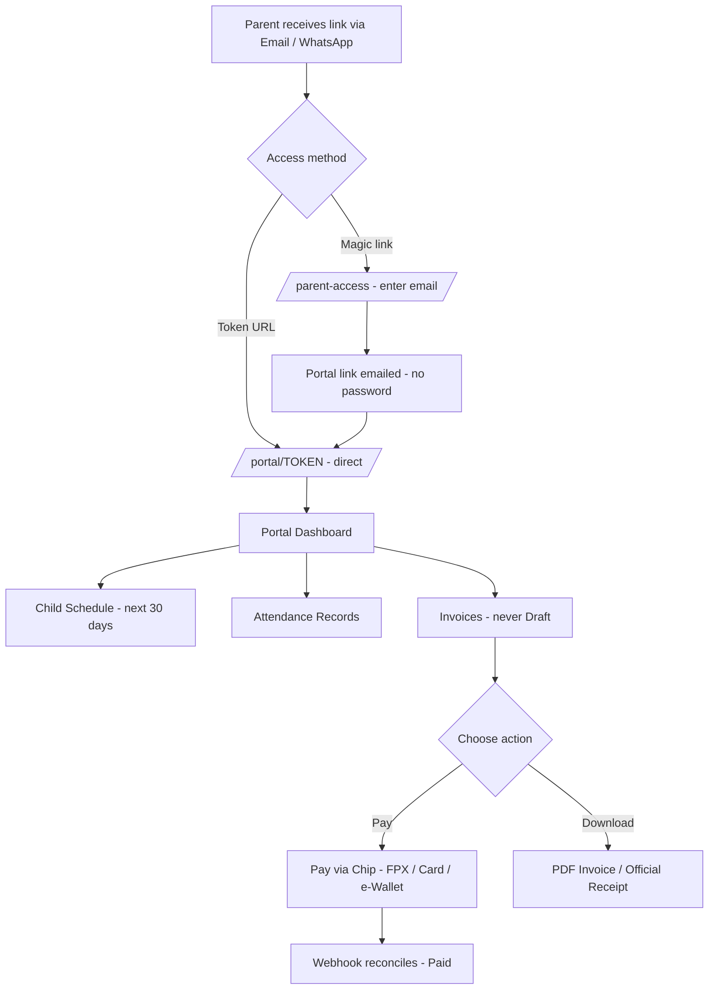

# UAT Section F — Parent (Parent Portal)

> Part of the [X Chess Academy OS UAT Plan](../UAT.md) · Status legend: ✅ Pass · ❌ Fail · ⚠️ Blocked · ⬜ Not Run

## 1. Parent Portal Flow

**Pre-conditions:** seeded parent tokens (`/portal/demo-parent-1` … `/portal/demo-parent-15`); use a parent with Pending invoices for payment tests. Test while **logged out** — the portal never requires a staff session.

## 2. Access

| ID | Test Case | Steps | Expected Result | Status | Notes |
| :--- | :--- | :--- | :--- | :---: | :--- |
| PAR-01 | Token URL access | Open `{APP_URL}/portal/demo-parent-1` (logged out) | Parent dashboard loads: parent name, children, schedule, invoices | ⬜ | |
| PAR-02 | Invalid token | Open `/portal/not-a-real-token` | 404 — no data leaked | ⬜ | |
| PAR-03 | Magic link — known email | `/parent-access` → enter an existing parent email (deliverable mailbox) | Generic success message; portal access link email arrives | ⬜ | Needs real mailbox |
| PAR-04 | Magic link — unknown email | `/parent-access` → enter `nobody@nowhere.test` | **Same generic message** ("If an account exists…") — no account enumeration | ⬜ | |
| PAR-05 | Magic link throttling | Submit `/parent-access` more than 5 times within a minute | Rate limited (HTTP 429 / "too many attempts") | ⬜ | `throttle:5,1` |

## 3. Dashboard, Schedule & Attendance

| ID | Test Case | Steps | Expected Result | Status | Notes |
| :--- | :--- | :--- | :--- | :---: | :--- |
| PAR-10 | Children list | Open portal | All of the parent's students listed (e.g. parent1 has Adam & Haris) — and **only** their children | ⬜ | |
| PAR-11 | 30-day schedule | Check the schedule section | Upcoming sessions for the next 30 days: date, class name, time, **room**, **coach** (substitute coach shown when session has one), topic when recorded | ⬜ | |
| PAR-12 | No other children's data | Compare two parent portals (demo-parent-1 vs demo-parent-2) | Each portal shows only that family's classes/students/invoices | ⬜ | |
| PAR-13 | Attendance visibility | After CCH-07 records attendance, open the parent portal | Attendance history reflects the recorded Present/Absent statuses | ⬜ | |

## 4. Invoices, Payments & PDFs

| ID | Test Case | Steps | Expected Result | Status | Notes |
| :--- | :--- | :--- | :--- | :---: | :--- |
| PAR-20 | Invoice list | Open portal → Invoices | Only this family's invoices; statuses Pending/Paid/Overdue; **Draft invoices never visible** | ⬜ | |
| PAR-21 | Invoice breakdown | Click **View Invoice** on a Pending invoice | Itemized breakdown: base tuition, tax, recurring discount, credit/charge adjustments, total | ⬜ | |
| PAR-22 | Another family's invoice blocked | Construct `/portal/{tokenA}/invoices/{invoiceOfOtherFamily}` | 404 — access denied | ⬜ | |
| PAR-23 | PDF invoice download | Download the PDF invoice | Branded PDF downloads with correct amounts & company details | ⬜ | |
| PAR-24 | Pay via Chip (success) | Click **"Pay RMXXX via Chip"** → complete sandbox payment (FPX/card/e-wallet) | Redirects to Chip sandbox checkout in MYR; after payment, returns to the invoice (`?payment=success`) and the invoice is **Paid** | ⬜ | Requires Chip sandbox config |
| PAR-25 | Webhook reconciliation | After PAR-24, refresh the invoice | Status Paid; a Payment record exists with Chip transaction ID; activity log entry "marked Paid via Chip Webhook" | ⬜ | |
| PAR-26 | Payment cancel/failure | Start checkout, then cancel/fail at Chip | Returned to the invoice (`?payment=cancelled`/`failed`); invoice remains **Pending**; no Payment record | ⬜ | |
| PAR-27 | Already-paid guard | Click Pay on a Paid invoice | Message "This invoice has already been paid in full." — no second checkout | ⬜ | |
| PAR-28 | Unconfigured gateway | Clear Chip settings (sandbox test) → click Pay | Friendly error "Chip Payment Gateway is currently unconfigured…" | ⬜ | |
| PAR-29 | Official receipt (paid) | Open a **Paid** invoice → **Official Receipt PDF** | Receipt PDF downloads with payment/transaction reference | ⬜ | |
| PAR-30 | Receipt blocked (unpaid) | Attempt receipt on a Pending invoice | Error "Receipt is only available for paid invoices." | ⬜ | |
| PAR-31 | Mobile checkout | Complete PAR-24 entirely on a phone | Portal + Chip checkout + redirect all usable on mobile | ⬜ | |

---

## Section Result Summary

| Total Cases | Pass | Fail | Blocked | Not Run | Pass Rate |
| :---: | :---: | :---: | :---: | :---: | :---: |
| 21 | | | | | |
