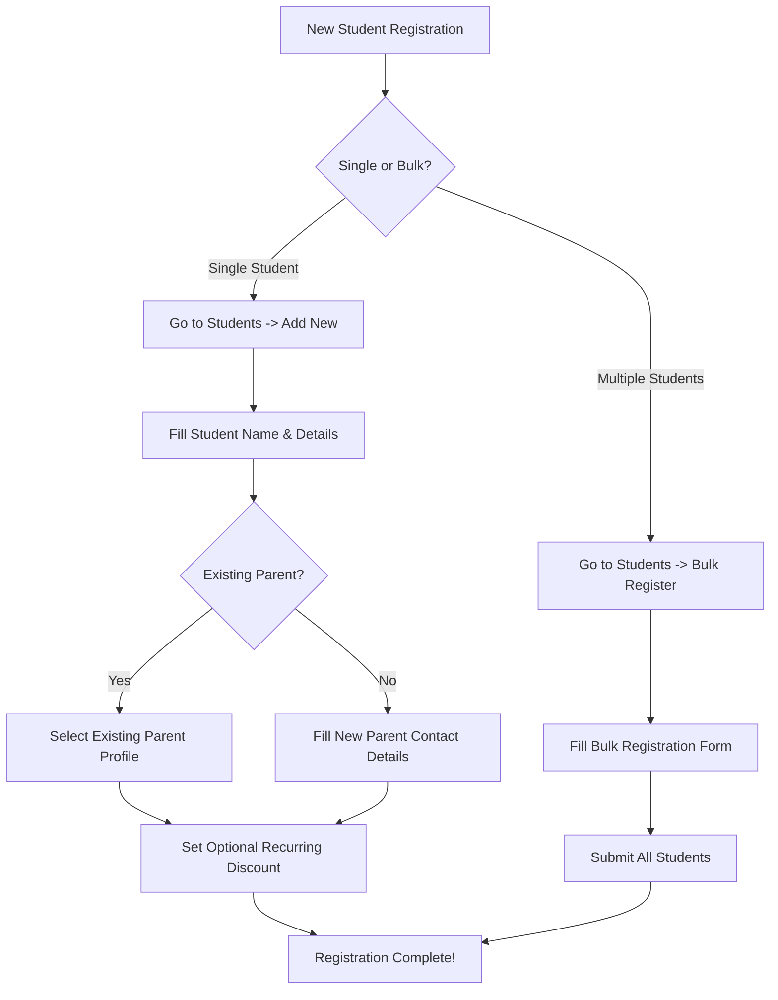

# How-To Guide: Student Onboarding & Parent Registration

This guide explains how to register new students, link them to parents, perform bulk student registrations, and configure recurring discounts.

---

## 📊 Process Flowchart

---

## 📋 Registration Method Comparison

| Method | Best Used For | Parent Linking | Key Advantage |
| :--- | :--- | :--- | :--- |
| **Single Registration** | Individual walk-ins or phone inquiries | Auto-link existing OR create new parent | Custom discount setup during creation |
| **Bulk Registration** | Batch intake at the start of a term | Auto-group by parent contact email | Fast registration for 5-20 students at once |

---

## 📝 Step-by-Step Instructions

### Option 1: Single Student Registration

1. Navigate to **Students** in the main navigation sidebar.
2. Click the blue **"+ Add New"** button at the top right of the page.
3. **Fill Student Details**:
   - Enter Full Name, Date of Birth, Gender, Level (e.g. `Beginner`, `Intermediate`, `Advanced`), and Status (`Active`).
4. **Parent Information**:
   - **Existing Parent**: Toggle "Link to Existing Parent" and search by parent name or phone number.
   - **New Parent**: Enter the parent's Full Name, Email, Phone Number, and Address.
5. **Recurring Discount (Optional)**:
   - Enter a fixed amount (e.g., `RM 20.00`) or percentage discount. This discount will be automatically applied every month when draft invoices are generated.
6. Click **"Register Student"** to save.

> [!TIP]
> Each registered parent receives a unique **Access Token Link** which allows them to view their child's portal without needing to remember a password!

---

### Option 2: Bulk Student Registration

1. Navigate to **Students** in the main sidebar.
2. Click the dropdown arrow next to "+ Add New" and select **"Bulk Register"**.
3. Add as many student rows as needed.
4. Enter Student Name, Level, Package, and Parent Email for each row.
5. Click **"Submit Bulk Registration"**. The system automatically groups students sharing the same parent email under one parent account.

---

## 💡 Frequently Asked Questions

> [!NOTE]
> **Q: What happens if a family has two or more children enrolled?**  
> **A:** Simply link both students to the same parent profile. The Parent Portal will display all enrolled siblings under one unified dashboard!
