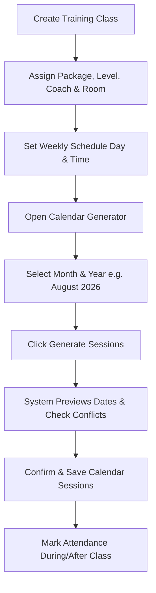

# How-To Guide: Class Setup, Calendar Generator & Attendance

This guide explains how to set up training classes, generate monthly calendar sessions, and record student attendance.

---

## 📊 Process Flowchart

---

## 📋 Attendance Status Definitions

| Status | Color Badge | Meaning | Impact on Tuition |
| :--- | :--- | :--- | :--- |
| **Present** | 🟢 Green | Student attended the class session | Standard session delivered |
| **Absent (Notice)** | 🟡 Yellow | Absent with prior notification (eligible for makeup) | Entitled to replacement credit |
| **Unexcused Absence** | 🔴 Red | Absent without prior notice | Session counted as delivered |
| **Cancelled** | ⚪ Gray | Class session cancelled by academy or public holiday | Session rescheduled / credited |

---

## 📝 Step-by-Step Instructions

### Step 1: Create a Training Class

1. Go to **Classes** in the main sidebar.
2. Click **"+ Create Class"**.
3. Fill in the class details:
   - **Class Name**: e.g., `Junior Intermediate Group A`
   - **Level**: Select target level (`Beginner`, `Intermediate`, `Advanced`, `Master`).
   - **Package**: Choose fee structure (e.g. `Monthly 4-Lesson Package`).
   - **Coach**: Select primary assigned coach or dual-role staff member.
   - **Room**: Assign training room (e.g. `Hall A`).
   - **Weekly Day & Time**: Select day (e.g. `Saturday`) and time (e.g. `10:00 AM - 11:30 AM`).
4. Click **"Save Class"**.

---

### Step 2: Generate Monthly Calendar Sessions

1. Go to **Classes → Schedule Generator** (or click **"Generate Sessions"** from any class page).
2. Select target **Month & Year** (e.g., `August 2026`).
3. Click **"Preview Calendar"**. The system checks:
   - Room availability (no double booking).
   - Coach schedule availability.
4. Click **"Confirm & Save Sessions"**. All individual class dates for the month are created automatically!

---

### Step 3: Record Class Attendance

1. During or after a class, open **Attendance** from the sidebar (or via Coach Portal).
2. Select the **Class** and **Date**.
3. For each student listed:
   - Click **Present** 🟢 if attended.
   - Click **Absent (Notice)** 🟡 or **Unexcused** 🔴 if absent.
4. If a substitute coach taught the session, update the **"Substitute Coach"** field so session pay is credited correctly!
5. Click **"Save Attendance"**.

> [!TIP]
> Coaches can access the **Coach Portal** on their mobile phone to mark attendance directly in the classroom!
