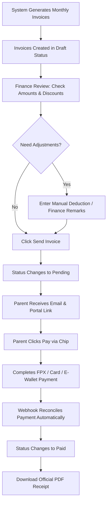

# How-To Guide: Billing, Invoicing & Chip Online Payments

This guide explains how monthly draft invoices are generated, reviewed by Finance, sent to parents, paid online via Chip Gateway, and exported as official PDF documents.

---

## 📊 Invoicing & Payment Flowchart

---

## 📋 Invoice Status Legend

| Status | Badge Color | Meaning | Allowed Actions |
| :--- | :--- | :--- | :--- |
| **Draft** | ⚪ Gray | Under internal finance review | Edit adjustments, Send Invoice |
| **Pending** | 🟡 Yellow | Sent to parent; awaiting payment | Pay via Chip, Download PDF Invoice |
| **Paid** | 🟢 Green | Payment completed and reconciled | Download Official PDF Receipt |
| **Overdue** | 🔴 Red | Past due date without payment | Resend notification, Pay via Chip |

---

## 📝 Step-by-Step Instructions

### Step 1: Generating Draft Invoices

Monthly draft invoices are generated automatically by the system at the start of each billing cycle, or manually via **Invoices → Generate Monthly Drafts**.
- Draft invoices calculate:  
  `Total = Base Tuition Fee + Tax - Recurring Student Discount`

---

### Step 2: Finance Review & Manual Adjustments

1. Open **Invoices** from the main sidebar.
2. Click **View** on any invoice in `Draft` status.
3. If an adjustment is needed (e.g. credit for cancelled class or sibling allowance):
   - Enter amount in **Manual Adjustment**.
   - Enter explanatory reason in **Finance Remarks**.
   - Click **"Save Adjustment"**. The total amount updates in real-time.

---

### Step 3: Sending Invoices to Parents

1. Review the finalized invoice details.
2. Click **"Send Invoice"**.
3. Status changes from `Draft` to `Pending`. The parent receives:
   - Email notification with billing summary.
   - Tokenized Parent Portal link.

---

### Step 4: Parent Online Checkout (Chip Gateway)

1. Parent opens their portal link on mobile or desktop.
2. Click **"Pay RMXXX via Chip"**.
3. Select payment method:
   - **FPX Online Banking** (Maybank, CIMB, RHB, Public Bank, etc.)
   - **Credit / Debit Cards** (Visa, Mastercard)
   - **E-Wallets** (Touch 'n Go, GrabPay, Boost)
4. Once payment succeeds, Chip sends instant webhook reconciliation to the academy OS.
5. Invoice status changes to `Paid` immediately!

---

### Step 5: Downloading PDF Documents

- **PDF Invoice**: Click **"📄 Download PDF Invoice"** on any pending or paid invoice to stream a printable PDF document with academy branding.
- **Official Receipt**: Once an invoice is `Paid`, click **"🧾 Official Receipt PDF"** in the Parent Portal or Admin panel to download an official payment receipt with transaction reference ID.

> [!TIP]
> PDF invoices and receipts dynamically display the Academy Name, SSM Registration No, Phone, Email, and Bank Transfer details configured in **Settings → Company Profile**!
