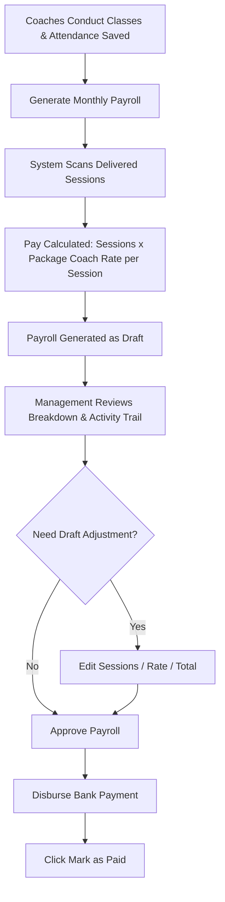

# How-To Guide: Coach Management & Monthly Payroll

This guide explains how to add coaches, manage dual-role staff members who teach, generate monthly session-based payroll, review payroll calculations, edit Draft totals, and mark payments as completed.

---

## 📊 Payroll Process Flowchart

---

## 📋 Dual-Role Coach Capabilities

Some administrators or operations staff members also teach classes. The system natively handles **Dual-Role Staff**:

| User Type | Primary Role | Coach Capabilities | Where They Appear |
| :--- | :--- | :--- | :--- |
| **Dedicated Coach** | `Coach` | Teaches classes & earns session pay | Coach Portal, Class Selectors, Payroll |
| **Dual-Role Admin** | `Admin` | Admins system AND teaches classes (`is_coach = true`) | Admin Portal, Class Selectors, Session Payroll |
| **Operations Staff** | `Ops` | Manages ops AND teaches classes (`is_coach = true`) | Admin Portal, Class Selectors, Session Payroll |

---

## 📝 Step-by-Step Instructions

### Step 1: Adding a Coach or Enabling Dual-Role

1. Go to **Users / Staff** or **Coaches** in the main sidebar.
2. **Dedicated Coach**: Click **"+ Add Coach"**, enter profile, contact details, bank info, and profile compensation details.
3. **Dual-Role Staff**: Click **Edit** on an existing Admin or Ops staff member, check **☑ "Also acts as a Coach"**, and set their Hourly Rate.
4. Click **"Save"**. Dual-role users can switch seamlessly between Admin View and Coach View using the top header button!

---

### Step 2: Generating Monthly Payroll

1. Go to **Payrolls** in the main sidebar.
2. Click **"Generate Monthly Payroll"**.
3. Select the billing **Month & Year** (e.g. `July 2026`).
4. Click **"Run Payroll Calculation"**.
5. The system scans all delivered sessions for every coach (including dual-role coaches), calculates each session's package rate, and stores a line-item snapshot:
   `Total Pay = Sum of Delivered Session Package Rates`

---

### Step 3: Reviewing & Approving Payroll

1. Click **View** on any payroll record.
2. Review the session breakdown: attendance date, class, package, and rate.
3. Review the activity trail for generation, edits, and previous status changes.
4. If the payroll is `Draft`, click **Edit**, adjust sessions/rate/total, and save. The edit is recorded in the activity trail.
5. Click **"Approve Payroll"**. Status changes to `Processed`.
6. Perform bank transfer or disbursement.
7. Click **"Mark as Paid"**. Status updates to `Paid`.

### Coach Visibility

Coaches can open **My Payrolls** and view their own payroll summary, session breakdown, and activity trail. They cannot edit payrolls or view another coach's payroll.

> [!IMPORTANT]
> Coach payroll is calculated strictly on **actual delivered sessions** using the **Package's coach rate per session**, ensuring payroll is 100% decoupled from student discounts or invoice adjustments. Regenerating an existing payroll preserves its current status.
