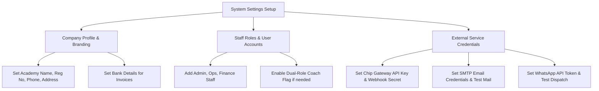

# How-To Guide: Staff Management, Branding & System Settings

This guide explains how to manage staff users and roles, set up academy branding and bank info, and configure external services like Chip Payment Gateway, SMTP Mailer, and WhatsApp.

---

## 📊 System Configuration Workflow

---

## 📋 Staff Role Permissions Matrix

| Module / Feature | Admin | Ops | Finance | Coach |
| :--- | :---: | :---: | :---: | :---: |
| **Student & Parent Onboarding** | ✅ Full | ✅ Full | 👁️ Read | ❌ No |
| **Classes & Schedule Generator** | ✅ Full | ✅ Full | 👁️ Read | 👁️ Assigned |
| **Attendance Recording** | ✅ Full | ✅ Full | 👁️ Read | ✅ Assigned |
| **Invoicing & Finance Adjustments** | ✅ Full | 👁️ Read | ✅ Full | ❌ No |
| **Coach Payroll Approval** | ✅ Full | 👁️ Read | ✅ Full | 👁️ Self Only |
| **Company & Service Settings** | ✅ Full | ❌ No | ❌ No | ❌ No |

---

## 📝 Step-by-Step Instructions

### Step 1: Configuring Company Profile & Bank Details

1. Open **Settings** under *System & Settings* in the main sidebar.
2. Select the **Company Profile** tab.
3. Enter your **Company / Academy Name** (e.g. `X Chess Academy`).
4. Enter **SSM / Registration Number** (e.g. `202401012345 (SSM)`).
5. Fill in **Official Contact Email**, **Phone Number**, and **Physical Address**.
6. Enter **Bank Account & Transfer Details** (e.g. `Maybank: 5140 1234 5678 (X Chess Academy Sdn Bhd)`).
7. Click **"Save Company Profile"**. These details update all PDF invoices and receipts automatically!

---

### Step 2: Managing Users & Roles

1. Open **Users / Staff** from the main sidebar.
2. Click **"Add New User"**.
3. Enter Full Name, Email, Password, and select Primary Role (`Admin`, `Ops`, `Finance`, `Coach`).
4. If the staff member also teaches classes, check **"Also acts as a Coach"**.
5. Click **"Create User"**.

---

### Step 3: Configuring External Services

1. Open **Settings** under *System & Settings* in the main sidebar.
2. **Email / SMTP** tab: Enter Mail Host, Port, Username, Password, and From Address. Click **"Send Test Email"** to verify transmission.
3. **WhatsApp** tab: Select provider (`Twilio`, `WABA`, `UltraMsg`) and enter API credentials. Click **"Test WhatsApp"** to send a test message.
4. **Chip Payment** tab: Enter Brand ID, API Key, and Webhook Secret. Click **"Test Chip Connection"** to verify.
5. **Notification System** tab: Configure global enable/disable, daily dispatch limit, retry policy, and admin alert email.
6. Click **"Save"** on each tab.
