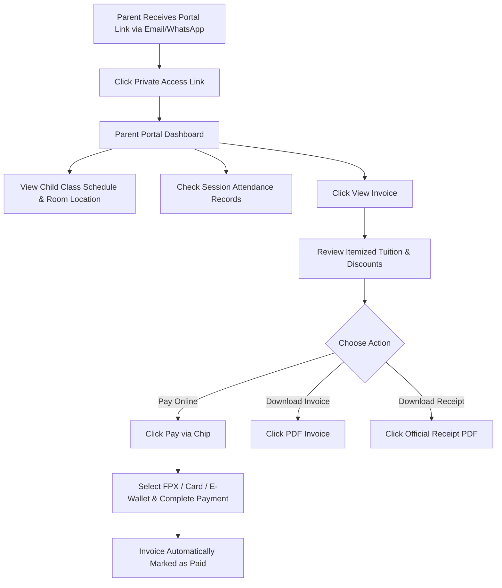

# Parent Portal User Guide (For Families)

Welcome to the **X Chess Academy Parent Portal**! This guide explains how parents can access their child's schedules, check attendance, view invoices, download official PDF receipts, and make online payments.

---

## 📊 Parent Portal Flowchart

---

## 📋 Available Portal Features

| Feature | Description | Action Available |
| :--- | :--- | :--- |
| **Child Schedule** | Weekly class timetable, time, coach, and room location | View live calendar |
| **Attendance Records** | Full attendance history for all sessions | View session status badges |
| **Invoice Breakdown** | Itemized tuition fees, taxes, and recurring discounts | View breakdown table |
| **Online Payments** | Instant checkout via Chip Payment Gateway | FPX, Visa, Mastercard, Touch 'n Go |
| **PDF Downloads** | Printable PDF Invoices and Official Payment Receipts | Download & Save to Device |

---

## 📝 Step-by-Step Instructions

### Step 1: Accessing Your Parent Portal

1. Open your private access link received via Email or WhatsApp (format: `https://academy.com/portal/YOUR-TOKEN`).
2. No password is required! Your link securely logs you directly into your family dashboard.

---

### Step 2: Checking Schedules & Attendance

1. On the portal homepage, view your child's active class enrollments.
2. Check the **Day & Time**, assigned **Coach**, and **Training Room**.
3. View the attendance history to see sessions marked **Present** 🟢 or **Absent** 🟡.

---

### Step 3: Viewing & Paying Invoices Online

1. Scroll to the **Invoices** section on your dashboard.
2. Click **View Invoice** next to any pending bill.
3. Review the itemized breakdown:
   - Base Tuition Fee
   - Sibling or Package Discounts
   - Total Amount Payable
4. Click the blue **"Pay RMXXX via Chip"** button.
5. Select your preferred payment method:
   - **FPX Online Banking** (Maybank2u, CIMB Clicks, RHB, Public Bank, etc.)
   - **Credit / Debit Cards** (Visa, Mastercard)
   - **E-Wallets** (Touch 'n Go, GrabPay, Boost)
6. Complete the payment on your bank's secure page.
7. Upon returning to the portal, your invoice will immediately update to **PAID** 🟢!

---

### Step 4: Downloading Official Receipts

1. Open any **Paid** invoice in your portal.
2. Click the green **"🧾 Official Receipt PDF"** button.
3. Your official payment receipt will download automatically to your phone or computer for your tax or record-keeping records.
